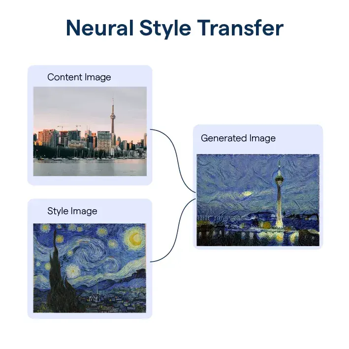

# 🎨 Picasso, I Choose You!

**A neural style transfer studio for designers and artists.** Bring a photo and a
piece of art, and the app repaints your photo in that artwork's style — an original
interpretation, not a canned filter.

<p align="center">
  
</p>

---

## ✨ What it's for

Built for real creative work — no design suite and no maths knowledge required:

- 🖼️ **Posters & prints** — turn a photo into striking wall art
- 📚 **Album & book covers** — give a shot a painterly, one-of-a-kind look
- 📱 **Social & marketing** — original visuals that don't look stock
- 🎨 **Mood boards & concepts** — explore a style direction fast
- 👕 **Merch & branding** — distinctive artwork from your own images

## 🎛️ How it feels to use

- **Upload two images** — a photo (the content) and an artwork (the style)
- **Move a few plain-language sliders** — how strongly the style takes over, how
  much detail, how bold the texture
- **Create** — the studio blends them into something new that's yours
- **Download** your result as a PNG

Because the style is captured as *texture and colour statistics* rather than copied
literally, every output is an original reinterpretation — which is what makes this a
genuine creative tool rather than a one-click effect.

## 🧠 How it works

A pretrained **VGG19** network reads both images. The **content** of your photo is
taken from a deep layer's activations; the **style** of the artwork is taken from the
correlations between features (**Gram matrices**) across several layers. The output
image's *pixels* are then optimised until its content matches your photo while its
style matches the artwork — minimising `α·content + β·style + a smoothness term`.

This follows the method of **Gatys, Ecker & Bethge (2015)** and Prof. Mitesh Khapra's
*Deep Art* lecture (CS7015, IIT Madras).

## 🛠️ Tech stack

- **Python** — core language
- **PyTorch** — deep learning framework
- **VGG19** (pretrained on ImageNet, via torchvision) — a *frozen* feature extractor;
  its weights are never trained
- **Gram matrices** — capture style as feature co-occurrence, independent of position
- **L-BFGS optimiser with strong-Wolfe line search** — optimises the image *pixels*
  (not the network); the line search is what lets the style fully set in
- **Total Variation loss** — keeps the output smooth rather than noisy
- **Streamlit** — the interactive web interface
- **Pillow & NumPy** — image loading and array handling
- **uv** — fast, reproducible dependency management (CPU-only PyTorch)
- **Streamlit Community Cloud** — hosting, with auto-redeploy from GitHub

## 🚀 Use it

```bash
uv sync
uv run streamlit run app.py
```

Open the **Create** tab, upload a photo and an artwork, set the sliders, and create.
A **How it works** tab explains the method and credits the sources.

## 🙏 Credits

- Prof. Mitesh M. Khapra — *Deep Art* lecture, CS7015 (Deep Learning), IIT Madras
- Leon A. Gatys, Alexander S. Ecker & Matthias Bethge — *A Neural Algorithm of
  Artistic Style* (2015), arXiv:1508.06576
- VGG19 — Simonyan & Zisserman (2014)